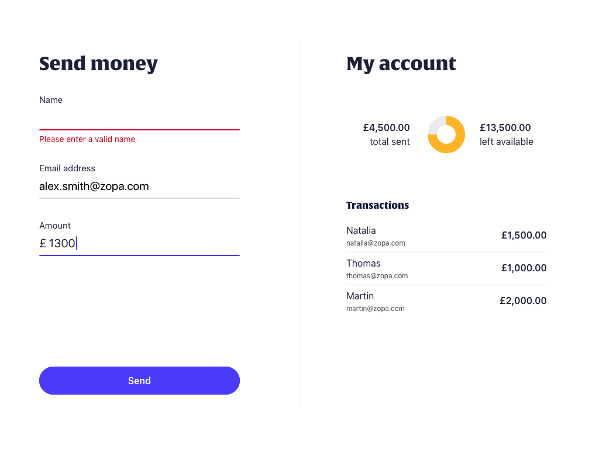

# ReactJS Coding Challenge - Zopa

You're here because you've been asked by the Zopa team to submit a solution to a coding challenge as part of the interview process.

Congratulations on getting through to this stage! We hope that you'll find this challenge fun – it's not meant to take you more than **4 hours**. We're happy to take a look at partial solutions, too.

We are looking for best practices used, a demonstration of the understanding of the technology. You must use React to achieve this challenge and you are free to use any other libraries or tools.

## Description

You are about to create a web application to send money to friends.

On the left side of the screen, you have a form where you can send money to someone. On the right side, you have your account details.

You fill the form with your friend's details, name, email and amount you'd like to send. Each field of the form has inline validation displaying error messages when one of the field is not valid. Clicking the "Send" button will create a transaction if the fields are valid and there is enough money available in the account.

The account shows how much money you have sent so far and how much you have left available. You can set the initial amount to whichever value you'd like. The difference is represented on a circular chart updating every time you send money to someone. Under it, you can see the details of all transactions sent.

## Your task

- Build the screen to match perfectly with the design provided.
- Implement the logic as described above.
- Provide unit tests.

Bonus points - optional, only if you have enough time:
- The application is designed for desktop. With some creativity, make the design responsive to look great on mobile devices as well.
- To make this challenge more realistic, you can submit the form in asynchronous to an api server and add the transaction when you get an valid response. You can use something like [json-server](https://github.com/typicode/json-server) to create a quick javascript server.

## Submit your challenge

Before you submit your solution, create a markdown file `INSTRUCTIONS.md` with documentation about how we can run your project. When you're happy with your solution, zip it up and send it to your recruiter. Do not publish your solution to a publicly accessible repository.

## Suggested libraries and tools

- [create-react-app](https://github.com/facebook/create-react-app): Easy to install and to get started. 
- [redux](https://github.com/reactjs/redux): Keep the entire state of your app in a single place. 
- [styled-components](https://github.com/styled-components/styled-components): Utilising tagged template literals to style your components. 
- [typescript](https://github.com/Microsoft/TypeScript)/[flow](https://github.com/facebook/flow): Strong types make your code more reliable when you work in larger teams. 
- [jest](https://github.com/facebook/jest): Easy unit testing framework for javascript. 

## Assets provided

Designs and fonts are provided in the `design` folder.
